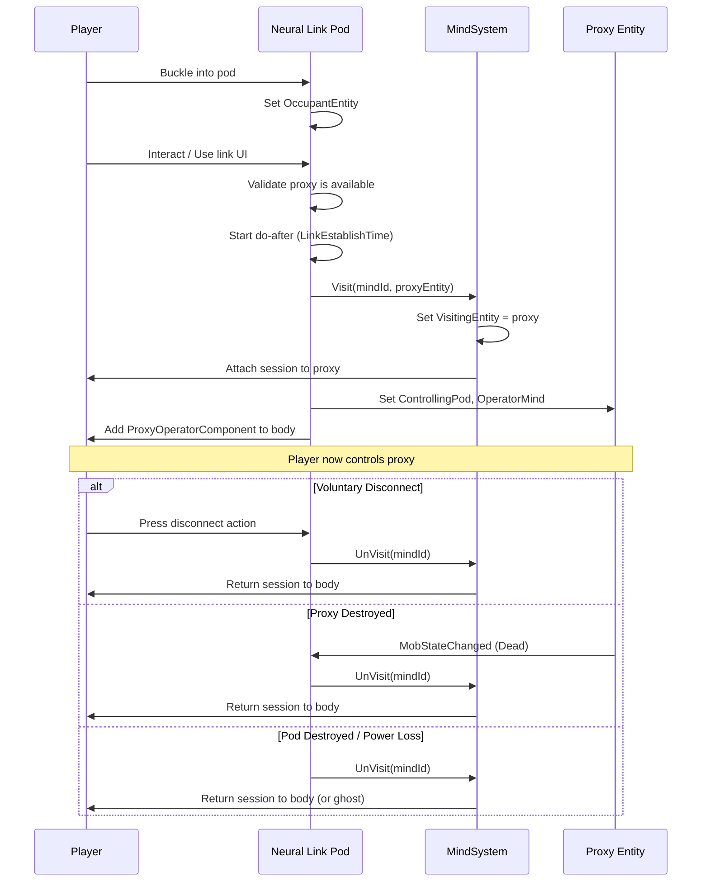

# Proxy Control System — Feature Outline

> **Avatar-style remote control**: A player enters a Neural Link Pod, their viewpoint and inputs transfer to a remote cyborg (or other proxy entity), and they operate it as if it were their own body — while their original body remains safely buckled in the pod.

---

## 1. Core Concept

```
┌──────────────┐     Neural Link     ┌──────────────┐
│  Player Body │ ═══════════════════ │  Proxy Entity │
│  (in Pod)    │   (mind.Visit())    │  (Cyborg etc) │
│  Unconscious │                     │  Player's POV │
└──────────────┘                     └──────────────┘
```

The player interacts with a **Neural Link Pod** (a chair/bed-like structure). Once buckled in and linked, their `MindComponent.VisitingEntity` is set to the target proxy entity. The player now sees through the proxy's eyes and issues inputs to it. Their original body is rendered unconscious/immobile in the pod.

**Key distinction from existing borg flow**: the existing borg system uses `MindSystem.TransferTo()` which *permanently* moves the mind's `OwnedEntity`. This feature instead uses the **Visit** pattern — the mind *visits* the proxy while still *owning* the original body, allowing a clean return.

---

## 2. Terminology

| Term | Meaning |
|---|---|
| **Operator** | The player who enters the pod |
| **Pod** | Neural Link Pod — the physical machine the operator sits in |
| **Proxy** | The remote-controlled entity (cyborg, drone, mech, etc.) |
| **Link** | The active connection between pod and proxy |
| **Severance** | Forced or voluntary disconnection from the proxy |

---

## 3. High-Level Architecture

### 3.1 ECS Components

#### `NeuralLinkPodComponent` (Shared)

Attached to the pod entity. Tracks the active link.

```csharp
[RegisterComponent]
public sealed partial class NeuralLinkPodComponent : Component
{
    /// The entity currently buckled into this pod (the operator's body).
    [DataField] public EntityUid? OccupantEntity;

    /// The proxy entity currently being controlled.
    [DataField] public EntityUid? LinkedProxy;

    /// Maximum range for maintaining the link (0 = unlimited).
    [DataField] public float MaxLinkRange;

    /// Whether the link is currently active.
    [DataField] public bool IsLinked;

    /// Time it takes to establish a link (startup delay).
    [DataField] public float LinkEstablishTime = 3f;

    /// Power draw while link is active.
    [DataField] public float ActivePowerDraw = 200f;
}
```

#### `ProxyControllableComponent` (Shared)

Attached to any entity that can be remote-controlled.

```csharp
[RegisterComponent]
public sealed partial class ProxyControllableComponent : Component
{
    /// The pod that is currently controlling this proxy (null if unlinked).
    [DataField] public EntityUid? ControllingPod;

    /// The mind entity of the operator currently visiting.
    [DataField] public EntityUid? OperatorMind;

    /// The operator's original body, for reference.
    [DataField] public EntityUid? OperatorBody;

    /// Whether to destroy/disable the proxy on severance.
    [DataField] public bool DisableOnSeverance = true;

    /// Optional: restrict which pod types can link to this proxy.
    [DataField] public EntityWhitelist? PodWhitelist;

    /// Signal frequency for device-network based linking.
    [DataField] public string? LinkFrequency;
}
```

#### `ProxyOperatorComponent` (Shared)

Temporary component added to the **operator's original body** when they are linked to a proxy. Used to track state and enforce immobility.

```csharp
[RegisterComponent]
public sealed partial class ProxyOperatorComponent : Component
{
    /// The pod the operator is buckled into.
    [DataField] public EntityUid Pod;

    /// The proxy entity being controlled.
    [DataField] public EntityUid Proxy;
}
```

### 3.2 Systems

#### `NeuralLinkPodSystem` (Server)

The central server-side system. Handles:

| Responsibility | Method / Event |
|---|---|
| Buckling into the pod | `OnBuckle` — validates occupant, sets `OccupantEntity` |
| Initiating a link | `TryEstablishLink(pod, proxy)` — validates, starts the do-after |
| Completing a link | `OnLinkEstablished` — calls `MindSystem.Visit()` to move the player's viewpoint to the proxy |
| Severing a link | `SeverLink(pod)` — calls `MindSystem.UnVisit()`, returns player to body |
| Range checking | `Update()` — if `MaxLinkRange > 0`, checks distance each tick and severs if exceeded |
| Power failure | `OnPowerChanged` — severs link if pod loses power |
| Pod destruction | `OnPodDestroyed` — severs link and handles consequences |
| Proxy death/destruction | `OnProxyMobStateChanged` — severs link when proxy dies |
| Operator body damage | `OnOperatorDamaged` — optionally sever on threshold |
| Unbuckling | `OnUnbuckle` — severs link first, then allows unbuckle |

#### `ProxyControllableSystem` (Server)

Handles proxy-side logic:

- Marks the proxy as "operator-controlled" for UI/admin purposes
- Relays certain events back to the pod (damage feedback, status)
- Handles proxy-specific restrictions (e.g., proxy can't enter certain areas)

#### `NeuralLinkPodSystem` (Client)

- UI for selecting which proxy to link to (if multiple available)
- Visual feedback: link status indicator, signal strength, etc.
- Camera/viewport transition effects on link/sever

---

## 4. Connection Flow



---

## 5. Proxy Discovery & Targeting

How does the operator choose *which* proxy to link to?

### Option A: Frequency-Based (DeviceNetwork)

The pod and proxy share a radio frequency. The pod scans for `ProxyControllableComponent` entities on its frequency. This uses the existing `DeviceNetworkSystem`.

- **Pro**: Fits existing infrastructure, allows multi-channel setups
- **Con**: Requires frequency configuration

### Option B: Beacon/ID-Based

Each proxy has a unique beacon ID. The operator types or selects the ID from a list.

- **Pro**: Simple, selective
- **Con**: Requires UI for ID management

### Option C: Direct Entity Linking

The pod is pre-configured (in map editor or via wrench) to link to a specific proxy entity.

- **Pro**: Simplest implementation, good for station-bound setups
- **Con**: Inflexible at runtime

> [!TIP]
> **Recommended**: Start with **Option C** (direct entity linking) for initial implementation, then add **Option A** (frequency-based) for more dynamic gameplay.

---

## 6. Failure Modes & Severance

| Trigger | Consequence |
|---|---|
| Player unbuckles from pod | Link severed, player returns to body |
| Pod loses power | Link severed, player returns to body |
| Pod is destroyed | Link severed, player gets sensory feedback (screen flash, stun) |
| Proxy is killed | Link severed, player returns to body, optional feedback damage |
| Proxy moves out of range | Link severed (if range-limited) |
| Operator body takes critical damage | Link severed, player returns to damaged body |
| EMP hits pod or proxy | Link disrupted — visual static, possible sever |

### Feedback Damage (Optional)

When the proxy is destroyed, the operator can receive "neural feedback" — a configurable amount of brain/shock damage to represent the traumatic disconnection. This is controlled by a `FeedbackDamageOnProxyDeath` field on `NeuralLinkPodComponent`.

---

## 7. Operator Body State While Linked

While linked, the operator's body should be:

- **Immobile** — movement inputs go to the proxy, not the body
- **Visually unconscious** — lying down, eyes closed, sleeping sprite state
- **Vulnerable** — can still take damage, be dragged, etc.
- **Cannot be interacted with as "awake"** — no speech, no hand interactions

This can be achieved by:
1. Adding a **status effect** (similar to sleep/unconsciousness) when the link is established
2. Removing it when the link is severed
3. The `ProxyOperatorComponent` prevents the body from being ghosted or re-occupied

---

## 8. Pod Design

### Physical Properties

- **Appearance**: A reclining chair/capsule with holographic displays and cables
- **Buckleable**: Uses the existing buckle/strap system
- **Powered**: Requires an APC connection; configurable power draw
- **Constructable**: Built from standard materials + advanced electronics
- **Anchored**: Must be bolted to the floor

### UI Elements

- **Link status indicator** (Unlinked / Linking / Linked)
- **Proxy health/battery readout** (relayed from proxy)
- **Signal strength** (if range-limited)
- **Disconnect button**
- **Proxy selector** (if multiple proxies available)

---

## 9. Proxy Types

The system should be generic enough to support multiple proxy types:

| Proxy Type | Description | Notes |
|---|---|---|
| **Cyborg Drone** | Standard bipedal robot | Full hands, modules, combat-capable |
| **Recon Drone** | Small flying drone | No hands, camera only, fast, fragile |
| **Mining Mech** | Heavy exosuit | Drill arms, cargo space, slow |
| **Medical Remote** | Surgical arms platform | Can perform surgery remotely |
| **Maintenance Bot** | Small wheeled robot | Can fit in vents, basic tools |

Each type just needs `ProxyControllableComponent` and whatever other components define its capabilities. The proxy control system is **type-agnostic**.

---

## 10. Networking Considerations

### State Synchronization

- The `Visit` mechanism already handles session attachment — the engine sends entity state for the proxy's PVS bubble
- The pod needs to relay proxy status (health, battery, position) back to the pod's UI via `UserInterfaceSystem`
- Link state changes (establish/sever) should use events or component state, not custom net messages where possible

### Prediction

- Link establishment should **not** be predicted (server-authoritative do-after)
- Proxy movement/actions use normal prediction since the player is now attached to that entity
- Severance should be server-authoritative with client-side visual feedback

---

## 11. Interaction with Existing Systems

| System | Interaction |
|---|---|
| **MindSystem** | Uses `Visit()`/`UnVisit()` — the core mechanism |
| **BuckleSystem** | Pod is a strap; operator buckles in |
| **PowerSystem** | Pod draws power; link severs on outage |
| **DeviceNetworkSystem** | Optional: proxy discovery via frequencies |
| **MobStateSystem** | Monitors proxy death for auto-sever |
| **StatusEffectSystem** | Applies unconscious-like state to operator body |
| **DamageSystem** | Optional feedback damage on proxy death |
| **AdminLogSystem** | Logs link/sever events |
| **AlertsSystem** | Proxy status alerts shown to operator |
| **DoAfterSystem** | Link establishment delay |

---

## 12. Actions & Keybindings

The operator should have access to:

| Action | Description |
|---|---|
| **Disconnect** | Voluntarily sever the link and return to body |
| **Toggle Camera Mode** | Switch between proxy POV and a third-person/overview |
| **Proxy Self-Destruct** | Destroy the proxy remotely (if permitted) |

These are implemented as `InstantAction` entities granted when the link is established and removed on severance.

---

## 13. Balancing Levers

| Parameter | Purpose |
|---|---|
| `LinkEstablishTime` | Prevents instant deployment; gives counterplay window |
| `MaxLinkRange` | Limits operational radius |
| `ActivePowerDraw` | Resource cost; vulnerable to sabotage |
| `FeedbackDamageOnProxyDeath` | Risk for the operator |
| Proxy build cost | Economic balance |
| Proxy fragility / health | Combat balance |
| One-pod-one-proxy limit | Prevents proxy spam |
| Cooldown between link attempts | Prevents rapid re-linking |

---

## 14. Future Extensions

- **Multi-proxy switching**: Operator can switch between multiple proxies without returning to body
- **Sensory relay**: Proxy damage causes visual distortion / audio feedback to operator
- **Proxy autonomy**: AI takes over proxy when no operator is linked (ghost role offering)
- **Signal jamming**: Antagonist tool that disrupts links in an area
- **Proxy upgrades**: Module system (similar to borg modules) for swappable loadouts
- **Neural damage**: Extended use causes cumulative brain damage to operator
- **Co-piloting**: Two pods linked to one proxy for split control (one moves, one fires)

---

## 15. Suggested File Structure

```
Content.Shared/ProxyControl/
├── Components/
│   ├── NeuralLinkPodComponent.cs
│   ├── ProxyControllableComponent.cs
│   └── ProxyOperatorComponent.cs
├── Events/
│   ├── ProxyLinkEstablishedEvent.cs
│   ├── ProxyLinkSeveredEvent.cs
│   └── ProxyLinkAttemptEvent.cs
└── SharedProxyControlSystem.cs

Content.Server/ProxyControl/
├── NeuralLinkPodSystem.cs
├── ProxyControllableSystem.cs
└── ProxyControlSystem.cs

Content.Client/ProxyControl/
├── NeuralLinkPodSystem.cs
├── ProxyControlBoundUserInterface.cs
└── UI/
    └── NeuralLinkPodMenu.xaml / .cs

Resources/Prototypes/Entities/Structures/Machines/
└── neural_link_pod.yml

Resources/Prototypes/Entities/Mobs/Silicon/
└── proxy_cyborg.yml  (or added to existing borg prototypes)
```
